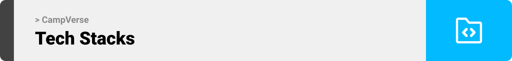

<br><br>

<!-- project philosophy -->


> CampVerse aims to manage the journey of mentors and students during a bootcamp, by providing a user-friendly paltform having everything they need, creating and submitting assignments, getting ai feedback on students assignments , creating bootcamp weekly schedule , publishing weekly students results and the ability to communicate with users on the platform , all in just one place.

### Admin Stories
- As an admin, I should be able to create new bootcamps and add students and mentors to it
- As an admin, I want the ability to create the bootcamp curriculum containig all the modules and stack that will be given during the bootcamp
- As an admin, I want the ability to create the bootcamp's schedule , assigning sessions to mentors with specific time and specific dates

### Mentor Stories
- As a mentor, I want to create new assignments 
- As a mentor, I want the ability to get ai feedback on any of my students assignments
- As a mentor, I want to publish weekly results to the students in the bootcamp

### Student Stories
- As a student, I have the ability to submit an assignment and upload my files
- As a student, I want to see my private weekly results 
- As a student, I have the ability to see the bootcamp's weekly schedule 


<br><br>
<!-- Tech stack -->


###  CampVerse is built using the following technologies:

- This project uses the [React Library](https://react.dev/). React is a JavaScript library for building user interfaces. It makes it easy to create reusable components and manage complex UIs, and [TypeScript](https://www.typescriptlang.org/), a superset of JavaScript that adds static typing to the language.

- This project uses [Go](https://go.dev/) For the backend side of the application with [Fiber](https://gofiber.io). Fiber is a Go web framework built on top of Fasthttp, the fastest HTTP engine for Go. It's designed to ease things up for fast development with zero memory allocation and performance in mind.

- In addition to [Go](https://go.dev/) with [Fiber](https://gofiber.io) for the main backend functionality, this project uses also [Node.js](https://nodejs.org/en) paired with the [Express.js](https://nodejs.org/en) to handle the real-time features of this project.
- This project uses [MySQL](https://www.mysql.com/) as the primary database which is ideal for applications with structured data, requiring complex queries and a fixed schema.

- This project also uses [MongoDB](https://www.mongodb.com/) for the real time features of the project.

- To send real time messages and notifications, the project uses [Socket.IO](https://socket.io/). Which is a JavaScript library for real time web applications. It enables bidirectional communication between clients and servers in real time .

- This project uses [Electron](https://www.electronjs.org/) For the admin side, electron enable building desktop applications with web libraries and frameworks

<br><br>
<!-- UI UX -->


> We designed CampVerse using wireframes and mockups, iterating on the design until we reached the ideal layout for easy navigation and a seamless user experience.

- Project Figma design [figma](https://www.figma.com/file/LsuOx5Wnh5YTGSEtrgvz4l/Purrfect-Pals?type=design&node-id=257%3A79&mode=design&t=adzbABt5hbb91ucZ-1)


### Mockups
| Home screen  | Menu Screen | Order Screen |
| ---| ---| ---|
|  |  |  |

<br><br>

<!-- Database Design -->


###  Architecting Data Excellence: Innovative Database Design Strategies:


<br><br>


<!-- Implementation -->


| Landing page |
| ---|
|  |

| Auth screen | Google authentication |
| ---| ---|
|  |  |


| Live chat + notification |
| ---|
|  |

| AI feedback on student assignment |
| ---|
|  |


# Admin Screens


| Home screen  | Edit profile |
| ---| ---|
|  |  |

| Search users  | Add user to bootcamp |
| ---| ---|
|  |  |

| Add weekly modules  | Create bootcamp schedule |
| ---| ---|
|  |  |

# Mentor Screens

| Assignment statistics  | Create assignment |
| ---| ---|
|  |  |

| Weekly results |
| ---|
|  |
<br><br>


<!-- Prompt Engineering -->


###  Mastering AI Interaction: Unveiling the Power of Prompt Engineering:

- This project uses advanced prompt engineering techniques to optimize the interaction with natural language processing models. By skillfully crafting input instructions, we tailor the behavior of the models to achieve precise and efficient language understanding and generation for various tasks and preferences.

<br><br>

<!-- AWS Deployment -->


###  Efficient AI Deployment: Unleashing the Potential with AWS Integration:

- This project leverages AWS deployment strategies to seamlessly integrate and deploy natural language processing models. With a focus on scalability, reliability, and performance, we ensure that AI applications powered by these models deliver robust and responsive solutions for diverse use cases.

<br><br>

<!-- Unit Testing -->


###  Precision in Development: Harnessing the Power of Unit Testing:

- This project employs rigorous unit testing methodologies to ensure the reliability and accuracy of code components. By systematically evaluating individual units of the software, we guarantee a robust foundation, identifying and addressing potential issues early in the development process.

<br><br>


<!-- How to run -->


> To set up Coffee Express locally, follow these steps:

### Prerequisites

This is an example of how to list things you need to use the software and how to install them.
* npm
  ```sh
   npm install npm@latest -g
  ```
* Go
   Make sure you have Go installed on your machine. You can download and install it from the official website: [Go](https://golang.org/dl)
* Database
   You need to ensure that [XAMPP](https://www.apachefriends.org/), [MySQL](https://dev.mysql.com/downloads/installer/) are installed on your device.
### Installation

_Below is an example of how you can instruct your audience on installing and setting up your app. This template doesn't rely on any external dependencies or services._

1. Get an openAI API Key from [openai](https://openai.com/)
2. Clone the repo
   git clone [github](https://github.com/NadimRifaii/CampVerse.git)
3. Setup the frontend
   ```sh
   cd client
   npm install
   ```
   Then go to .env.example file, rename it to .env and populate the values
   ```sh
   REACT_APP_FIREBASE_API_KEY=
   REACT_APP_FIREBASE_AUTH_DOMAIN=
   REACT_APP_FIREBASE_PROJECT_ID=
   REACT_APP_FIREBASE_STORAGE_BUCKET=
   REACT_APP_FIREBASE_MESSAGING_SENDER_ID=
   REACT_APP_FIREBASE_APP_ID=
   ```
   - Go to the Firebase Console: [https://console.firebase.google.com/](https://console.firebase.google.com/)
   - Create a new project or select an existing one.
   - In the project dashboard, click on the gear icon (Settings) and go to "Project settings."
   - Under the "General" tab, you'll find your Firebase SDK snippet. Choose the "Config" option, and you'll see the values for the variables above.
   - Copy and paste the values into the .env file.
3. Setup the go backend
   Open [phpMyAdmin](http://localhost/phpmyadmin/) and create a database called `campverse_db`
   ```sh
   cd server-go
   go mod download
   ```
   Then go to .env.example file, rename it to .env and populate the values
   ```sh
   secret="This can be whatever you want"
   OPENAI_API_KEY=
   ```
Now, you should be able to run CampVerse locally and explore its features.
