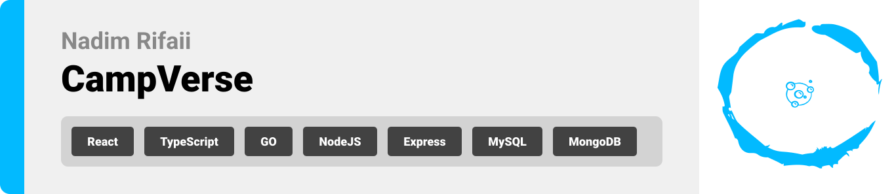
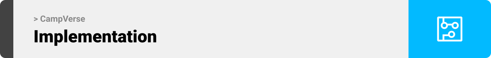

<br><br>

<!-- project philosophy -->


> A website where mentors and students meet up for a smooth bootcamp journey 
>
> CampVerse simplifies the mentorship journey with a user-friendly platform. We're committed to saving time, maximizing learning, and ensuring satisfaction. Join us in elevating the educational experience, where mentors and students meet seamlessly for a transformative journey.

### Admin Stories
- As an admin, I should be able to create new bootcamps with a name, description, and target audience.
- As an admin, I should be able to add mentors and students to bootcamps.
- As an admin, I want to access user profiles containing their details and edit their profile.
- As an admin, I want to invite a certain user to a bootcamp , specifying their role.
- As an admin, I want to communicate with them and possibility of deleting their account and removing them from all bootcamps.

### Student Stories
- As a student, upon submitting an assignment, I expect to receive instant feedback from the AI system, highlighting areas of strength and suggesting improvements.
- As a student, I want the opportunity to receive personalized feedback from the mentor after submitting an assignment. This could involve comments on specific aspects of my work or additional guidance for improvement.
- As a student, I receive a notification  indicating that meeting results have been posted by the mentor.
- As a student, I expect the ability to have a private chat with any of my mentors.

### Mentor Stories
- As a mentor, I want to create new assignments for my bootcamp and have an option to get help from ai, defining the task, providing necessary resources, and setting due dates.
- As a mentor, I want to post assignments to students and view all previous and upcoming assignments.
- As a mentor, I want to create a schedule for the week and see schedules of all previous weeks.
- As a mentor, I have the ability to post individual results for each student in the bootcamp.
- As a mentor, I have the ability to live chat with other users.
- As a mentor, I expect to receive notifications when a student submit his assignment.

<br><br>

<!-- Prototyping -->


> We designed Coffee Express using wireframes and mockups, iterating on the design until we reached the ideal layout for easy navigation and a seamless user experience.

### Wireframes
| Login screen  | Register screen |  Landing screen |
| ---| ---| ---|
|  |  |  |

### Mockups
| Home screen  | Menu Screen | Order Screen |
| ---| ---| ---|
|  |  |  |

<br><br>

<!-- Implementation -->


> Using the wireframes and mockups as a guide, we implemented the Coffee Express app with the following features:

### User Screens (Mobile)
| Login screen  | Register screen | Landing screen | Loading screen |
| ---| ---| ---| ---|
|  |  |  |  |
| Home screen  | Menu Screen | Order Screen | Checkout Screen |
|  |  |  |  |

### Admin Screens (Web)
| Login screen  | Register screen |  Landing screen |
| ---| ---| ---|
|  |  |  |
| Home screen  | Menu Screen | Order Screen |
|  |  |  |

<br><br>

<!-- Tech stack -->


###  Coffee Express is built using the following technologies:

- This project uses the [Flutter app development framework](https://flutter.dev/). Flutter is a cross-platform hybrid app development platform which allows us to use a single codebase for apps on mobile, desktop, and the web.
- For persistent storage (database), the app uses the [Hive](https://hivedb.dev/) package which allows the app to create a custom storage schema and save it to a local database.
- To send local push notifications, the app uses the [flutter_local_notifications](https://pub.dev/packages/flutter_local_notifications) package which supports Android, iOS, and macOS.
  - 🚨 Currently, notifications aren't working on macOS. This is a known issue that we are working to resolve!
- The app uses the font ["Work Sans"](https://fonts.google.com/specimen/Work+Sans) as its main font, and the design of the app adheres to the material design guidelines.

<br><br>

<!-- How to run -->


> To set up Coffee Express locally, follow these steps:

### Prerequisites

This is an example of how to list things you need to use the software and how to install them.
* npm
  ```sh
  npm install npm@latest -g
  ```

### Installation

_Below is an example of how you can instruct your audience on installing and setting up your app. This template doesn't rely on any external dependencies or services._

1. Get a free API Key at [https://example.com](https://example.com)
2. Clone the repo
   ```sh
   git clone https://github.com/your_username_/Project-Name.git
   ```
3. Install NPM packages
   ```sh
   npm install
   ```
4. Enter your API in `config.js`
   ```js
   const API_KEY = 'ENTER YOUR API';
   ```

Now, you should be able to run Coffee Express locally and explore its features.